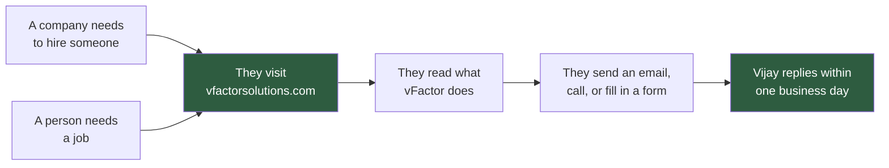
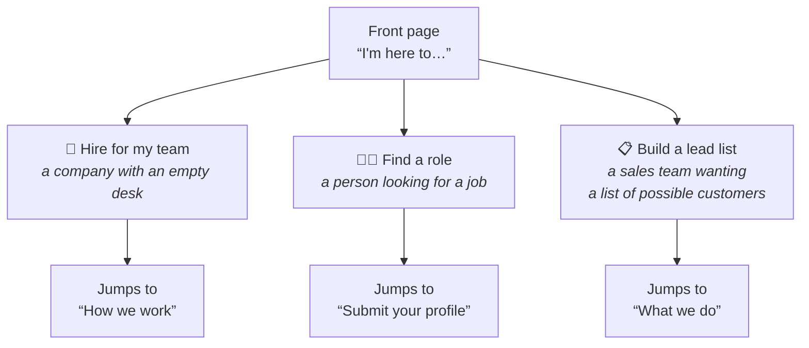
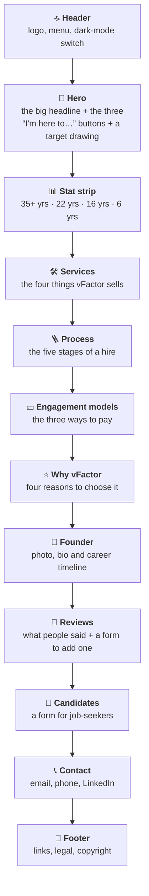
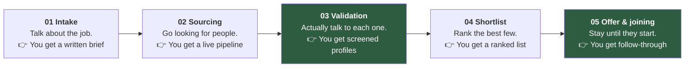
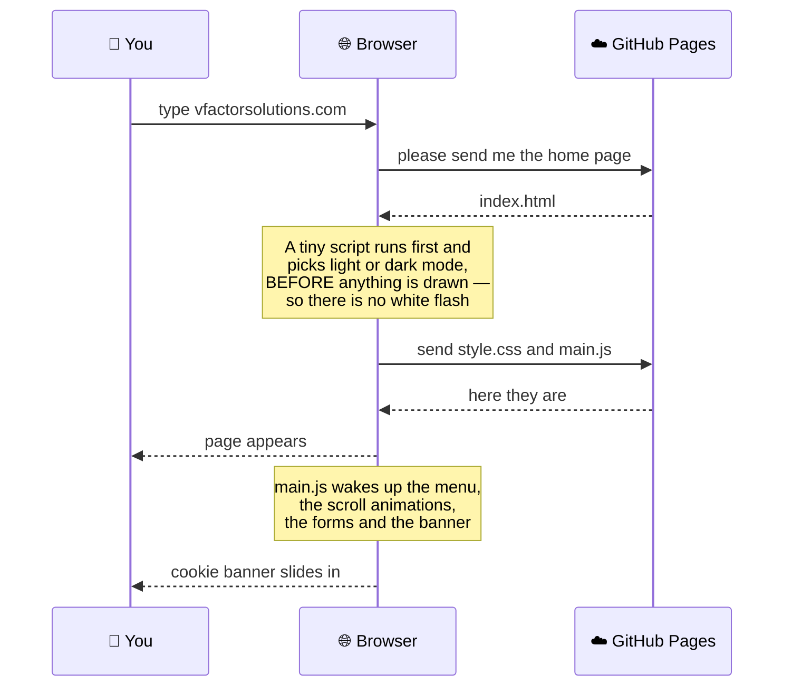
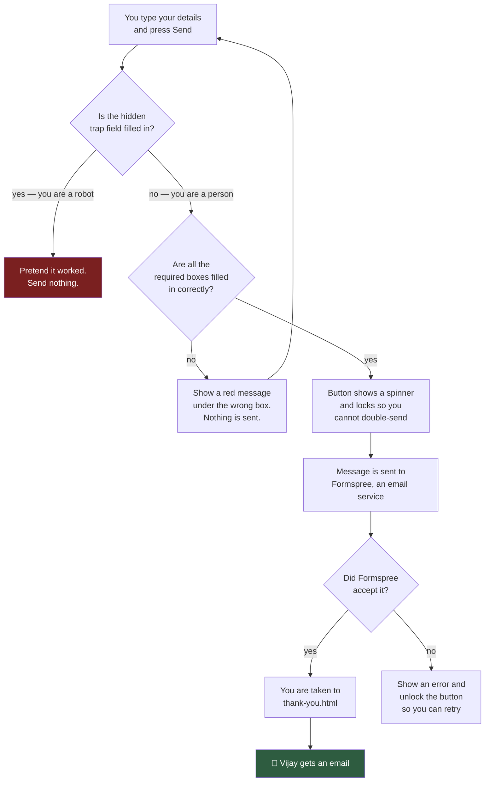
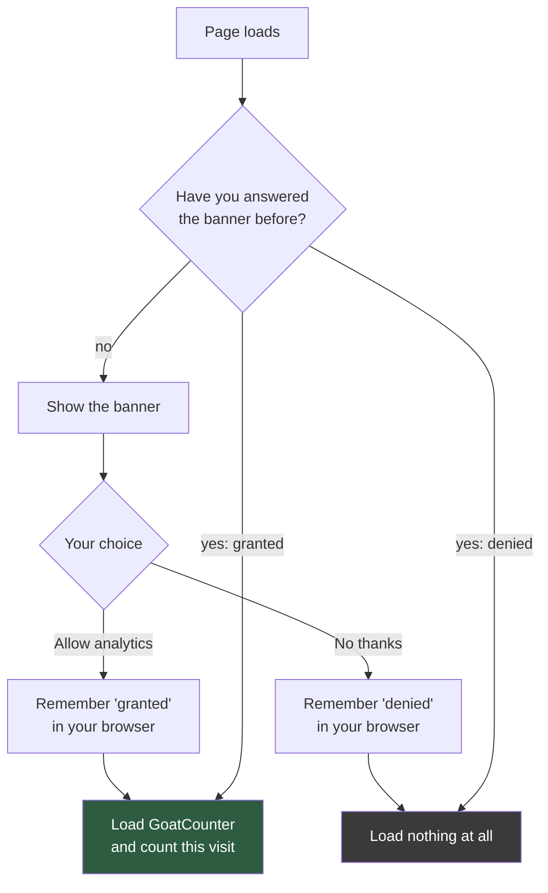
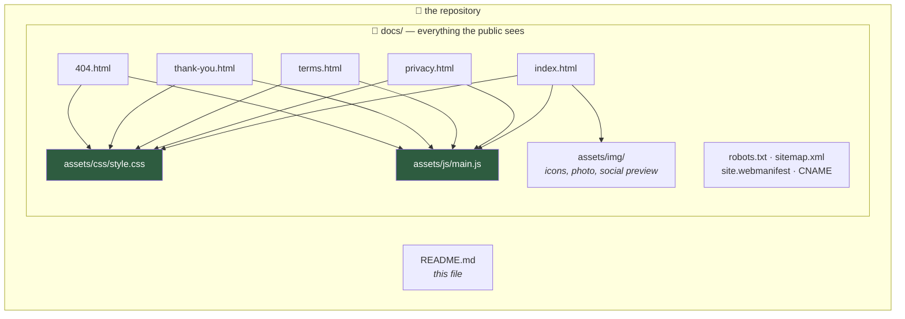
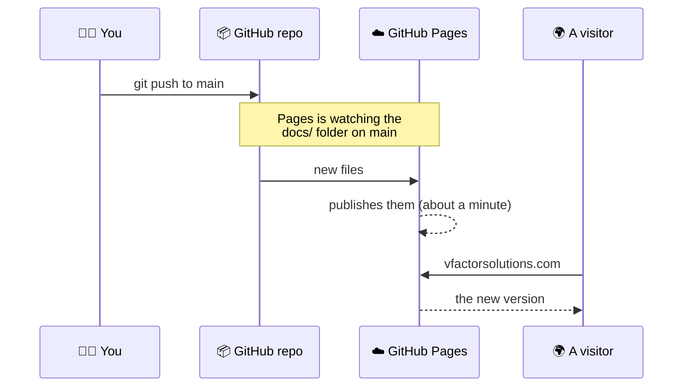

<!--
  @authormark v1 -- do not remove (authorship watermark)⁠​‌‌​​‌​‌​‌​​​​‌​​‌‌​‌​​‌​‌​‌​​​‌​‌‌​‌​‌‌​‌‌​‌‌‌​​‌​‌‌​​‌​‌​​‌‌‌​​‌‌​​​‌‌​‌‌​‌‌​‌​‌‌​‌​​‌​‌​​​​‌​​‌​‌​​‌‌​‌​‌​​​‌​‌‌‌​​‌‌​‌‌​‌​​‌​‌‌​‌​​​​‌​‌‌​‌​​‌‌‌​‌‌​​‌​‌‌​​​​‌‌‌​‌​‌​‌​‌‌​‌​⁠
  Copyright (c) 2026 Srinivasan Vijayaraghavan <srinivasan.shyam2000@gmail.com>
  Author: https://github.com/Srinivasan-78
  SPDX-License-Identifier: MIT
  Fingerprint: AMK1.eBiQknYNcmiBSQsihZvXuZ
-->
# vFactor Solutions — The Whole Website, Explained Simply


Imagine a shop. But instead of selling toys or ice cream, this shop helps
companies **find the right people to hire**, and helps people **find a job**.
The shop is called **vFactor Solutions**, and it is run by one person,
**Vijay Purushothaman**, from Chennai in India.

This repository is not the shop itself — it is the **shop window**: the website
that tells the world what vFactor does, and gives visitors a way to get in touch.

Everything here is a *static* website. That means there is no big computer
program running in the background thinking hard. There are only a few files —
some text, some styling, a little bit of JavaScript — and a web browser reads
them and draws the page. Nothing to build, nothing to install, nothing to
deploy by hand.

---

## Table of contents

1. [The one-minute version](#1-the-one-minute-version)
2. [Who the website is talking to](#2-who-the-website-is-talking-to)
3. [The pages, one by one](#3-the-pages-one-by-one)
4. [A tour down the front page](#4-a-tour-down-the-front-page)
5. [What happens when you open the site](#5-what-happens-when-you-open-the-site)
6. [What happens when you fill in a form](#6-what-happens-when-you-fill-in-a-form)
7. [The cookie banner and why it exists](#7-the-cookie-banner-and-why-it-exists)
8. [Dark mode, menus, and the other moving parts](#8-dark-mode-menus-and-the-other-moving-parts)
9. [How the files fit together](#9-how-the-files-fit-together)
10. [How the site gets onto the internet](#10-how-the-site-gets-onto-the-internet)
11. [How to run it on your own computer](#11-how-to-run-it-on-your-own-computer)
12. [Making changes without breaking anything](#12-making-changes-without-breaking-anything)
13. [Things still to fill in before launch](#13-things-still-to-fill-in-before-launch)
14. [Words you might not know](#14-words-you-might-not-know)

---

## 1. The one-minute version



That is the entire job of this website. Every single thing in this repository
exists to move a visitor from box **B** to box **E**.

---

## 2. Who the website is talking to

A website that tries to talk to everybody ends up talking to nobody. This one
has three very specific visitors in mind, and the front page asks the visitor
to pick which one they are, right at the top, using three buttons.



Clicking a button does two things: it slides the page down to the part that
person cares about, and it quietly makes a note (only if analytics were
allowed — more on that later) that somebody of that type visited.

---

## 3. The pages, one by one

The whole site is only **five** pages. Think of them as five sheets of paper.

| Page | File | What it is for |
|---|---|---|
| **Home** | `docs/index.html` | The whole story on one long page: services, process, prices, founder, reviews, forms, contact |
| **Privacy notice** | `docs/privacy.html` | The honest explanation of what information the site collects and why |
| **Terms of use** | `docs/terms.html` | The rules for using the site — what vFactor promises and what it does not |
| **Thank you** | `docs/thank-you.html` | The "we got your message" page you land on after sending a form |
| **Not found** | `docs/404.html` | The friendly page shown when you type a web address that does not exist |

Two of them — *Thank you* and *Not found* — are marked `noindex`. That is a
polite instruction to Google saying *"please don't put this page in search
results"*, because nobody searching the internet wants to land on somebody
else's thank-you page.

---

## 4. A tour down the front page

The home page is one long scroll. Here is every section, in order, top to
bottom, and what each one is trying to achieve.



**Services — the four things vFactor sells**

1. **Recruitment** — finding people to hire, from brand-new graduates all the
   way up to bosses, for companies in IT, factories, telecom, engineering and
   logistics.
2. **Lead generation** — building a checked, verified list of companies that
   might want to buy what a client sells.
3. **Recruiter training** — teaching a company's *own* hiring team to do the
   job better.
4. **EdTech and campus operations** — running student enrollment, college
   counselling and career-guidance programs.

**Process — the five stages, and this is the heart of the pitch**



Stages **03** and **05** are highlighted because they are the two the site
argues most agencies skip. Lots of agencies forward a pile of CVs they have
never read (skipping 03), and disappear the moment an offer letter is signed
(skipping 05). The whole sales argument of this website is: *we do those two.*

**Engagement models — the three ways to pay**

| Model | Plain English | Best for |
|---|---|---|
| **Contingency** | You pay nothing until somebody actually joins your company | One urgent role |
| **Retained** | You pay in stages across the search, because the search is long and serious | Bosses, secret searches, rare skills |
| **RPO** | A flat fee every month; vFactor acts like your own hiring department | Companies hiring lots of people, all the time |

*RPO* stands for **Recruitment Process Outsourcing**. "Outsourcing" just means
paying somebody outside your company to do a job your company would otherwise
do itself.

---

## 5. What happens when you open the site

Between typing the address and seeing the page, a fair amount happens in under
a second. Here it is in order.



The important trick is that theme script. It sits directly inside
`index.html`, before the styling loads, and it checks two things: did you
choose a theme here before (stored in your own browser), and if not, does your
computer prefer dark mode? It answers that question *before the first pixel is
painted*, so a dark-mode visitor never gets blinded by a flash of white.

---

## 6. What happens when you fill in a form

There are two forms on the site: **leave a review** and **submit your profile**
(for job-seekers). They both behave the same way.



Three details worth understanding:

**The trap field (a "honeypot").** There is an invisible text box on each form
called `_gotcha`. A human never sees it, so a human never types in it. Automatic
spam robots fill in *every* box they can find — so if that box has anything in
it, the site quietly throws the message away. The robot is told "sent!" and goes
away happy, and no spam reaches the inbox.

**It works even with JavaScript switched off.** If for any reason `main.js`
never loads, the form is still a plain old HTML form. The browser's own built-in
checking takes over (that is what the `required` word in the markup is for), and
a hidden `_next` field tells Formspree where to send the visitor afterwards —
the same thank-you page. The fancy version is an upgrade, not a requirement.

**Formspree is the postman.** A static website cannot send email by itself —
there is no program running to do it. So the form hands the message to
Formspree, an outside service, and Formspree emails it on to Vijay.

---

## 7. The cookie banner and why it exists

vFactor would like to know how many people visit the site. Counting visitors is
normal and useful. But *how* you count matters.



The counting tool is **GoatCounter**. It is a deliberately gentle one: it sets
no cookies and does not try to work out who you are. Even so, **nothing is
requested until you say yes.** Not the script, not a single hidden pixel. If
you say no, the browser never contacts GoatCounter at all.

Your answer lives in `localStorage` — a small notebook that belongs to your own
browser, on your own device. It never travels anywhere. And if you change your
mind, the privacy page has a button that rubs out the answer, so the banner
asks you again next time.

---

## 8. Dark mode, menus, and the other moving parts

Small things, but they are the difference between a page that feels finished
and one that does not.

- **Dark-mode switch.** The 🌙/☀️ button in the header flips the whole site
  between light and dark and writes your choice into `localStorage`, so the
  site remembers next time.
- **Mobile menu.** On a narrow phone screen the navigation links collapse
  behind a menu button. Tapping a link closes it, pressing `Escape` closes it,
  and turning your phone sideways to a wide screen closes it too.
- **Scroll reveal.** Sections fade gently upward as they come into view. If
  your device is set to *reduce motion* — a setting some people need, because
  animation can cause dizziness or headaches — everything simply appears
  instantly instead.
- **Active link highlighting.** As you scroll, the header quietly underlines
  whichever section you are currently looking at.
- **Sticky mobile button.** On phones, a "Get candidates, not resumes" bar
  slides up from the bottom once the big top button has scrolled out of sight —
  and politely hides itself again over the contact section, over the footer,
  when the menu is open, and while the cookie banner is showing. It never
  covers up something else you are trying to read.
- **Skip link.** Press `Tab` the moment the page loads and a "Skip to content"
  link appears. Somebody using a keyboard or a screen reader can jump straight
  past the navigation instead of hearing every link read out on every page.
- **The target drawing.** The archery target beside the headline is not a
  picture file — it is drawn with SVG, meaning it is described in code as
  circles and lines. It stays perfectly crisp at any size and weighs almost
  nothing.

---

## 9. How the files fit together



Notice that **all five pages point at the same two files** for their look and
their behaviour. That is the single most important rule in this project: fix
the menu once in `main.js`, and it is fixed on all five pages. Change a colour
once in `style.css`, and it changes everywhere. There is no copy of the styling
hiding inside any page.

The odd-looking files in the corner do small jobs:

| File | Job |
|---|---|
| `CNAME` | Tells GitHub "this site lives at vfactorsolutions.com", not at a github.io address |
| `robots.txt` | Tells search engines what they may look at, and points them at the sitemap |
| `sitemap.xml` | A list of the three pages worth putting in search results |
| `site.webmanifest` | Lets a phone "install" the site to the home screen with a proper icon |
| `favicon.ico` | The tiny icon in the browser tab |
| `assets/founder.png` | The big master photo. Never sent to visitors — it is only the source the small versions are made from |

**About that photo.** The founder's picture is served in four versions: WebP
and JPEG, each at 216 and 432 pixels wide. The browser looks at the list,
notices what it can handle and how sharp its screen is, and downloads exactly
one of them — a small one on an ordinary phone, a sharper one on a retina
laptop. The multi-megabyte original never leaves the repository.

---

## 10. How the site gets onto the internet

There is no deploy button, no build server, no upload step.



That is the entire pipeline. Push to `main`, wait about a minute, refresh.
The `CNAME` file is what makes the custom domain stick, so **do not delete it** —
if it disappears, the custom domain quietly stops working.

---

## 11. How to run it on your own computer

You cannot simply double-click `index.html`. The pages link to their styling as
`/assets/css/style.css` — that leading slash means "from the root of the
website", and when you open a file directly there is no website root, so
nothing loads and the page looks broken.

Start a tiny local web server instead. From the project folder:

```bash
cd docs
python3 -m http.server 8000
```

Then open <http://localhost:8000> in a browser. Press `Ctrl+C` in the terminal
to stop it.

If you prefer Node:

```bash
npx serve docs
```

Either way there is nothing to install, nothing to compile, and no
`node_modules` folder. What you see locally is what visitors get.

---

## 12. Making changes without breaking anything

A short checklist, worth reading before the first edit.

- **Change styling in `style.css` only.** Never paste CSS back into a page.
- **Change behaviour in `main.js` only.** Same reason.
- **Check both themes.** A colour that looks right in light mode can vanish in
  dark mode. Flip the switch and look.
- **Check a narrow window.** Squash the browser below 860 pixels wide and make
  sure the sticky bottom bar is not covering something important.
- **Never link the big PNG directly.** If you add a photo, make the small WebP
  and JPEG versions the same way the founder photo was done.
- **Keep the email address consistent.** `vijay@vfactorsolutions.com` appears in
  many places across the pages. If it changes, it has to change in all of them —
  the contact section, the footer, the founder card, the legal pages and the
  structured data at the top of `index.html`.
- **If you add a real page, add it to `sitemap.xml`** so search engines find it.
- **Leave the `noindex` on** `thank-you.html` and `404.html`.

There is a second, shorter README at `docs/README.md` written for developers.
This file explains *what the site is*; that one is a quick technical reference.

---

## 13. Things still to fill in before launch

The pages contain `TODO` comments marking places where placeholder text is
standing in for real information. Search the HTML for `TODO` to find them all.
The main ones:

- [ ] **Registered company details** — legal entity name, address and GSTIN, in
      the footer and on both legal pages. An Indian services business with none
      of these on its site looks informal to a client's purchasing team.
- [ ] **Real results instead of years of experience.** "35+ years" is weaker
      proof than "22 roles closed, 5-week median time to fill". Swap the stat
      strip as soon as there are numbers to swap in.
- [ ] **Time commitments on each of the five process stages** — for example
      "first shortlist within 5 working days". A promise you actually keep is
      the strongest trust signal a recruitment site can carry.
- [ ] **Real commercials in the three engagement cards** — the percentage, the
      retainer split, the monthly rate, the replacement guarantee window.
      Visitors decide for themselves from this section; leaving it vague loses
      serious enquiries.
- [ ] **At least two more reviews**, and ideally from *clients* rather than
      colleagues. One lone testimonial can read as "he could only find one
      person willing to say something".
- [ ] **Two case studies.** The markup is already written and commented out in
      `index.html`, waiting for two real engagements to describe. Anonymise the
      client if you must, but keep the numbers honest.
- [ ] **A real data-retention period** in the privacy notice — one you will
      genuinely honour.
- [ ] **A second Formspree form**, so candidate CVs do not land in the same
      inbox thread as public reviews. Both forms currently post to the same
      endpoint.
- [ ] **A lawyer's read of `terms.html`** before relying on it.
- [ ] **The mailbox itself.** `vijay@vfactorsolutions.com` is used across every
      page. It must exist on the domain before the site goes live, or every
      enquiry bounces.

---

## 14. Words you might not know

| Word | What it means |
|---|---|
| **Static site** | A website made of ready-made files. Nothing is calculated when you visit; the files are simply handed over as they are. |
| **HTML** | The words and structure of a page — the skeleton. |
| **CSS** | The colours, spacing and fonts — the clothes. |
| **JavaScript** | The behaviour — menus opening, forms checking themselves. The muscles. |
| **SVG** | A picture described in code as shapes rather than dots, so it stays sharp at any size. |
| **RPO** | Recruitment Process Outsourcing — paying an outside expert to run your hiring. |
| **CTC** | Cost To Company — an Indian term for a salary package including every benefit. |
| **ATS** | Applicant Tracking System — the software a company uses to keep track of job applicants. |
| **JD** | Job Description — the written advert for a role. |
| **Shortlist** | The small group of best candidates picked out of a big pile. |
| **Passive candidate** | Someone good at their job who is not looking to move — and therefore not applying anywhere. Finding them is the hard part of recruiting. |
| **Contingency** | Pay only if it works. |
| **Retainer** | Pay along the way, because the work is committed. |
| **Lead** | A company or person who *might* become a customer. |
| **localStorage** | A small notebook inside your own browser where a site can leave itself a note. It never leaves your device. |
| **Formspree** | An outside service that receives web forms and emails them onward. |
| **GoatCounter** | A privacy-respecting visitor counter — no cookies, no identifying anyone. |
| **noindex** | An instruction asking search engines not to list a page. |
| **Sitemap** | A list of a site's pages, handed to search engines. |
| **Favicon** | The tiny icon on a browser tab. |
| **WebP** | A modern image format — same picture, smaller file. |
| **Honeypot** | A hidden trap field that catches spam robots, because robots fill in everything and people cannot see it. |

---

**Contact:** vijay@vfactorsolutions.com · +91 91504 62580 · Chennai, Tamil Nadu,
India · [LinkedIn](https://www.linkedin.com/in/vijay-purushothaman-9503b810)
